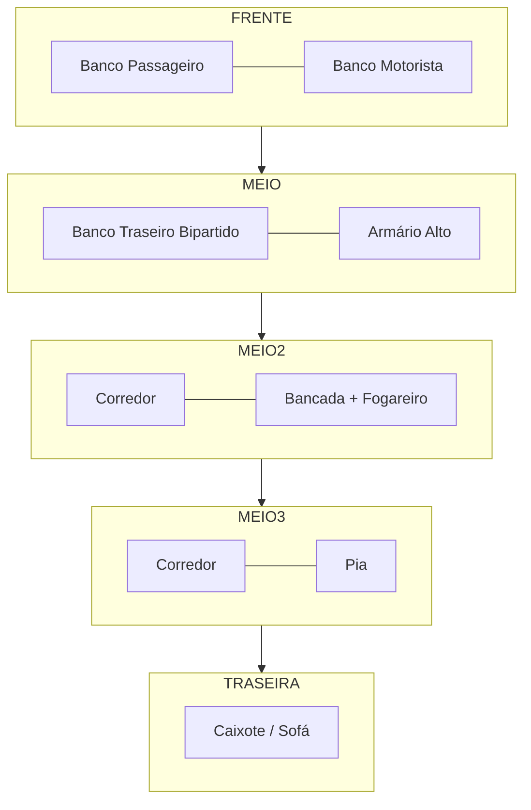

# Prompts e Sites para Imagens — Projeto Motorhome Doblò 2015

> Documento auxiliar para gerar referências visuais do projeto. Os prompts em **inglês** funcionam melhor na maioria dos geradores; os em **português** estão como apoio.

---

## 1. Sites recomendados

### Gratuitos (ou com plano free generoso)
| Site | URL | Forte em | Observações |
|---|---|---|---|
| **Microsoft Designer / Bing Image Creator** | bing.com/create | Realismo, segue prompt longo | Usa DALL·E 3, gratuito com conta Microsoft |
| **Google ImageFX** | aitestkitchen.withgoogle.com/tools/image-fx | Realismo fotográfico | Gratuito, qualidade alta |
| **Leonardo.ai** | leonardo.ai | Renderizações 3D, interiores | Plano free com créditos diários |
| **Ideogram** | ideogram.ai | Renderiza texto e diagramas | Bom para placas, etiquetas |
| **Adobe Firefly** | firefly.adobe.com | Comercialmente seguro | Free com créditos mensais |
| **Playground AI** | playground.com | Variedade de modelos | Free com limite diário |
| **Krea.ai** | krea.ai | Realtime, ajuste fino | Free limitado |

### Pagos (qualidade superior)
| Site | URL | Forte em |
|---|---|---|
| **Midjourney** | midjourney.com | Estética, realismo, design de interiores |
| **ChatGPT Plus (DALL·E 3)** | chatgpt.com | Segue instruções complexas |
| **Flux Pro** (via Replicate / Fal.ai) | fal.ai | Realismo fotográfico topo de linha |

### Para plantas baixas e desenhos técnicos (não AI puro, mas úteis)
| Site | Para quê |
|---|---|
| **Roomle** | roomle.com — planta 3D arrastando móveis |
| **Planner 5D** | planner5d.com — planta 2D/3D fácil |
| **SketchUp Free** | app.sketchup.com — modelagem 3D no navegador |
| **Floorplanner** | floorplanner.com — planta baixa rápida |

> **Dica:** para **planta baixa técnica** o melhor é usar Planner 5D ou SketchUp. Para **renderizações artísticas/conceituais** use os geradores de imagem AI.

---

## 2. Prompts por tipo de imagem

### 2.1 Vista externa — Doblò já transformado

**EN:**
```
A 2015 Fiat Doblò passenger van converted into a compact camper van, parked at a scenic countryside location at golden hour, side view. The van has a small solar panel on the roof, a roof vent fan, and a side window with mosquito screen. White exterior, clean and minimal modifications. Photorealistic, high detail, natural lighting, 35mm lens.
```

**PT:**
```
Uma Fiat Doblò 2015 passageiro transformada em mini motorhome, estacionada em uma paisagem rural ao entardecer, vista lateral. Painel solar pequeno no teto, exaustor no teto, janela lateral com tela mosquiteira. Cor branca, modificações discretas. Foto realista, alta resolução, iluminação natural.
```

---

### 2.2 Planta baixa — informações de base

> **⚠️ Importante:** geradores de imagem AI (DALL·E, Midjourney, Flux) são notoriamente ruins em plantas técnicas. Eles inventam proporções, erram texto, confundem esquerda/direita. Use AI só para conceito visual; **para a planta real, use Planner 5D, Floorplanner ou SketchUp Free** (seção 1).

#### Convenção espacial usada
- Vista de cima, **frente do veículo na parte SUPERIOR** da imagem
- **Lado direito da imagem** = lateral do motorista (cozinha)
- **Lado esquerdo da imagem** = lateral do passageiro (bancos/sofá)
- Essa convenção segue como você descreveu o projeto (olhando de fora pela traseira)

#### Dimensões aproximadas do Doblò 2015 (passageiro, versão curta)
- Comprimento externo: **~4,39 m**
- Largura externa (sem espelhos): **~1,83 m**
- Altura externa: **~1,83 m**
- Comprimento útil interno (atrás dos bancos dianteiros): **~2,0 m**
- Largura interna útil: **~1,5 m** (entre caixas de roda: ~1,23 m)
- Altura interna: **~1,30 m**

> **Confirme com trena.** Esses números variam por versão (curta vs. Maxi) e equipamento.

---

### 2.3 Planta baixa — modo cidade (esquema ASCII)

Regras de layout (atualizadas):
- **Caixote/sofá** ocupa só o lado passageiro (não atravessa para o lado motorista)
- **Corredor** é uma faixa central vertical que vai até a traseira (porta do porta-malas)
- **Lado motorista** (cozinha) é fixo: armário + bancada + pia, ocupando toda a profundidade

```
                          FRENTE
        ┌─────────────────┬───────────────────┐
        │ BANCO PASSAGEIRO│  BANCO MOTORISTA  │
        ├─────────────────┼───────────────────┤
        │                 │                   │
        │  BANCO TRASEIRO │  ARMÁRIO ALTO     │
        │  BIPARTIDO      │                   │
        │  (removível)    │                   │
        │                 │                   │
        ├──────────┬──────┼───────────────────┤
        │          │      │                   │
        │ CAIXOTE  │ COR  │  BANCADA          │
        │ / SOFÁ   │ RE   │  + FOGAREIRO      │
        │ (só lado │ DOR  │                   │
        │ passag.) │      ├───────────────────┤
        │          │      │  CUBA / PIA       │
        │          │  ↓   │                   │
        └──────────┴──────┴───────────────────┘
                  ↑ corredor                
                  vai até                   
                  porta traseira            
                          TRASEIRA
   ← lado passageiro             lado motorista →
```

---

### 2.4 Planta baixa — modo cama (esquema ASCII)

Regras (importante):
- **Lado motorista (pia + armário + bancada) NUNCA vira cama** — fica fixo
- A cama ocupa só o lado passageiro + corredor
- **Largura útil da cama ≈ 0,90 m** (lado passageiro ~0,55 m + corredor ~0,35 m) → na prática é um **solteiro largo**, não casal apertado. Veja "Atenção dimensional" abaixo.

```
                          FRENTE
        ┌─────────────────┬───────────────────┐
        │ BANCO PASSAGEIRO│  BANCO MOTORISTA  │
        ├─────────────────┼───────────────────┤
        │                 │                   │
        │  (banco trase.  │  ARMÁRIO ALTO     │
        │   REMOVIDO)     │                   │
        │                 │                   │
        │═════════════════│                   │
        │                 │                   │
        │  ★ COLCHÃO ★    ├───────────────────┤
        │  (~0,90×1,90 m) │  BANCADA          │
        │                 │  + FOGAREIRO      │
        │  apoiado em:    │                   │
        │  - caixote      ├───────────────────┤
        │  - tábuas       │  CUBA / PIA       │
        │    removíveis   │                   │
        │═════════════════│  (cozinha intacta)│
        │  CAIXOTE (base) │                   │
        └─────────────────┴───────────────────┘
                          TRASEIRA
```

#### ⚠️ Atenção dimensional
- Casal apertado ABNT/comercial: 1,20 × 1,88 m (mínimo)
- Espaço disponível na cama (não invadindo cozinha): ~0,90 × 1,90 m → **um solteiro largo**
- Se quiser casal apertado de fato, opções:
  1. Reduzir a profundidade do módulo de cozinha (pia + bancada mais estreitas) — ganha alguns cm
  2. Usar **estrado/colchão articulado** que se estende sobre a bancada da cozinha durante a noite (cobre a pia/fogareiro só em modo cama)
  3. Aceitar que será solteiro largo e dormir um por noite, ou casal bem grudado em ~0,90 m

---

### 2.5 Prompt detalhado para AI — modo cidade

> Use esse prompt depois de ter visto o ASCII acima. Ainda assim, espere imperfeições.

**EN:**
```
Architectural floor plan, top-down orthographic view of a Fiat Doblò 2015 passenger van interior, rectangular shape approximately 2 m long by 1.5 m wide (cargo area behind front seats). Vehicle FRONT at TOP, REAR at BOTTOM.

LEFT COLUMN (passenger side, ~0.55 m wide):
- Top: split rear bench seat ("BANCO TRASEIRO BIPARTIDO"), removable
- Bottom: rectangular wooden box ("CAIXOTE/SOFÁ"), occupies ONLY the left column — it does NOT span the full width of the vehicle

CENTER COLUMN (~0.35 m wide):
- A vertical aisle ("CORREDOR") starting after the front seats and extending all the way to the rear hatch — the corridor REACHES THE BACK OF THE VEHICLE, it is not blocked by the storage box

RIGHT COLUMN (driver side / kitchen, ~0.60 m wide, full depth):
- Top: tall cabinet ("ARMÁRIO ALTO")
- Middle: countertop with circular burner ("BANCADA + FOGAREIRO")
- Bottom: small square sink ("CUBA / PIA")

Above all of this, at the very top of the image, the original front seats: "BANCO PASSAGEIRO" (left) and "BANCO MOTORISTA" (right).

Style: clean black lines on white background, architectural blueprint, simple Portuguese labels, no perspective, pure top-down orthographic projection. Include "FRENTE" arrow at top, "TRASEIRA" arrow at bottom.
```

---

### 2.6 Prompt detalhado para AI — modo cama

**EN:**
```
Architectural floor plan, top-down orthographic view of the same Fiat Doblò camper in SLEEPING mode. FRONT at TOP, REAR at BOTTOM.

CRITICAL: The kitchen module on the RIGHT side (driver side) — tall cabinet, countertop with stove, sink — remains FULLY INTACT and is NOT covered by the bed. The bed never extends over the kitchen.

The split rear bench seat on the LEFT (passenger side) has been REMOVED — that floor area is empty.

A mattress (~0.90 m wide × 1.90 m long, labeled "COLCHÃO ~0,90×1,90") occupies the LEFT column + the CENTER aisle only. It is supported by:
- The wooden storage box at the rear-left ("CAIXOTE — BASE"), which stays in place
- Removable wooden boards bridging the corridor ("TÁBUAS REMOVÍVEIS")

The bed's right edge stops at the boundary of the kitchen module — the kitchen is visible alongside the bed.

Front seats at the very top, unchanged.

Style: clean architectural blueprint, black lines on white background, Portuguese labels, top-down orthographic, no perspective. Add a note label: "Cozinha permanece acessível mesmo com cama montada".
```

---

### 2.7 Alternativa que funciona muito melhor: SVG

Cole o código abaixo em qualquer editor de SVG online (ex: **svgviewer.dev**) ou salve como `.svg` e abra no navegador. Proporções aproximadas: largura 1,5 m (passageiro 0,55 m + corredor 0,35 m + motorista 0,60 m), comprimento útil 2,0 m.

#### Modo cidade
```svg
<svg xmlns="http://www.w3.org/2000/svg" viewBox="0 0 300 470" font-family="Arial" font-size="10">
  <!-- contorno do veículo -->
  <rect x="20" y="30" width="260" height="420" fill="#fff" stroke="#222" stroke-width="2" rx="20"/>

  <!-- legenda frente/traseira -->
  <text x="150" y="20" text-anchor="middle" font-weight="bold">↑ FRENTE</text>
  <text x="150" y="465" text-anchor="middle" font-weight="bold">↓ TRASEIRA (porta do porta-malas)</text>

  <!-- bancos dianteiros -->
  <rect x="35" y="45" width="100" height="55" fill="#dde" stroke="#333"/>
  <text x="85" y="78" text-anchor="middle">BANCO PASSAGEIRO</text>
  <rect x="165" y="45" width="100" height="55" fill="#dde" stroke="#333"/>
  <text x="215" y="78" text-anchor="middle">BANCO MOTORISTA</text>

  <!-- COLUNA ESQUERDA (passageiro) -->
  <!-- banco traseiro bipartido -->
  <rect x="35" y="115" width="80" height="120" fill="#cfd" stroke="#333"/>
  <text x="75" y="170" text-anchor="middle">BANCO</text>
  <text x="75" y="183" text-anchor="middle">TRASEIRO</text>
  <text x="75" y="196" text-anchor="middle">BIPARTIDO</text>
  <text x="75" y="215" text-anchor="middle" font-style="italic" font-size="9">(removível)</text>

  <!-- caixote/sofá (só lado passageiro, rear) -->
  <rect x="35" y="245" width="80" height="200" fill="#fcc" stroke="#333"/>
  <text x="75" y="335" text-anchor="middle">CAIXOTE</text>
  <text x="75" y="350" text-anchor="middle">/ SOFÁ</text>
  <text x="75" y="370" text-anchor="middle" font-size="9">(só lado</text>
  <text x="75" y="382" text-anchor="middle" font-size="9">passageiro)</text>

  <!-- COLUNA CENTRAL (corredor) -->
  <rect x="115" y="115" width="50" height="330" fill="#f5f5f5" stroke="#999" stroke-dasharray="4"/>
  <text x="140" y="270" text-anchor="middle" font-weight="bold">C</text>
  <text x="140" y="285" text-anchor="middle" font-weight="bold">O</text>
  <text x="140" y="300" text-anchor="middle" font-weight="bold">R</text>
  <text x="140" y="315" text-anchor="middle" font-weight="bold">R</text>
  <text x="140" y="330" text-anchor="middle" font-weight="bold">E</text>
  <text x="140" y="345" text-anchor="middle" font-weight="bold">D</text>
  <text x="140" y="360" text-anchor="middle" font-weight="bold">O</text>
  <text x="140" y="375" text-anchor="middle" font-weight="bold">R</text>
  <text x="140" y="430" text-anchor="middle" font-size="9">↓ até traseira</text>

  <!-- COLUNA DIREITA (motorista / cozinha) -->
  <!-- armário alto -->
  <rect x="165" y="115" width="100" height="120" fill="#fc9" stroke="#333"/>
  <text x="215" y="170" text-anchor="middle">ARMÁRIO</text>
  <text x="215" y="185" text-anchor="middle">ALTO</text>

  <!-- bancada + fogareiro -->
  <rect x="165" y="245" width="100" height="100" fill="#fda" stroke="#333"/>
  <text x="215" y="280" text-anchor="middle">BANCADA</text>
  <circle cx="215" cy="305" r="10" fill="none" stroke="#333" stroke-width="1.5"/>
  <text x="215" y="335" text-anchor="middle" font-size="9">FOGAREIRO</text>

  <!-- pia -->
  <rect x="165" y="355" width="100" height="90" fill="#cdf" stroke="#333"/>
  <text x="215" y="395" text-anchor="middle">CUBA / PIA</text>
  <circle cx="215" cy="415" r="12" fill="none" stroke="#333" stroke-width="1.5"/>

  <!-- legenda lateral -->
  <text x="20" y="465" font-size="9">← passageiro</text>
  <text x="280" y="465" text-anchor="end" font-size="9">motorista →</text>
</svg>
```

#### Modo cama
```svg
<svg xmlns="http://www.w3.org/2000/svg" viewBox="0 0 300 470" font-family="Arial" font-size="10">
  <!-- contorno do veículo -->
  <rect x="20" y="30" width="260" height="420" fill="#fff" stroke="#222" stroke-width="2" rx="20"/>

  <text x="150" y="20" text-anchor="middle" font-weight="bold">↑ FRENTE</text>
  <text x="150" y="465" text-anchor="middle" font-weight="bold">↓ TRASEIRA</text>

  <!-- bancos dianteiros (mantidos) -->
  <rect x="35" y="45" width="100" height="55" fill="#dde" stroke="#333"/>
  <text x="85" y="78" text-anchor="middle">BANCO PASSAGEIRO</text>
  <rect x="165" y="45" width="100" height="55" fill="#dde" stroke="#333"/>
  <text x="215" y="78" text-anchor="middle">BANCO MOTORISTA</text>

  <!-- área onde estava o banco traseiro: agora vazia (piso) -->
  <rect x="35" y="115" width="80" height="120" fill="#fafafa" stroke="#bbb" stroke-dasharray="3"/>
  <text x="75" y="170" text-anchor="middle" font-style="italic" font-size="9">(banco</text>
  <text x="75" y="183" text-anchor="middle" font-style="italic" font-size="9">traseiro</text>
  <text x="75" y="196" text-anchor="middle" font-style="italic" font-size="9">REMOVIDO)</text>

  <!-- COLCHÃO ocupando coluna esquerda + corredor -->
  <rect x="35" y="115" width="130" height="330" fill="#ffe4b5" stroke="#c80" stroke-width="2" opacity="0.85"/>
  <text x="100" y="245" text-anchor="middle" font-weight="bold" font-size="12">★ COLCHÃO ★</text>
  <text x="100" y="265" text-anchor="middle" font-size="10">~0,90 × 1,90 m</text>
  <text x="100" y="285" text-anchor="middle" font-size="9">(solteiro largo)</text>
  <text x="100" y="320" text-anchor="middle" font-size="9">apoiado em:</text>
  <text x="100" y="335" text-anchor="middle" font-size="9">• caixote (base)</text>
  <text x="100" y="350" text-anchor="middle" font-size="9">• tábuas removíveis</text>
  <text x="100" y="365" text-anchor="middle" font-size="9">  sobre corredor</text>

  <!-- caixote como base (visível como contorno) -->
  <rect x="35" y="395" width="80" height="50" fill="none" stroke="#c80" stroke-dasharray="5" stroke-width="1.5"/>
  <text x="75" y="425" text-anchor="middle" font-size="9" fill="#933">CAIXOTE (base)</text>

  <!-- COZINHA INTACTA (lado motorista) -->
  <rect x="165" y="115" width="100" height="120" fill="#fc9" stroke="#333"/>
  <text x="215" y="170" text-anchor="middle">ARMÁRIO</text>
  <text x="215" y="185" text-anchor="middle">ALTO</text>

  <rect x="165" y="245" width="100" height="100" fill="#fda" stroke="#333"/>
  <text x="215" y="280" text-anchor="middle">BANCADA</text>
  <circle cx="215" cy="305" r="10" fill="none" stroke="#333" stroke-width="1.5"/>
  <text x="215" y="335" text-anchor="middle" font-size="9">FOGAREIRO</text>

  <rect x="165" y="355" width="100" height="90" fill="#cdf" stroke="#333"/>
  <text x="215" y="395" text-anchor="middle">CUBA / PIA</text>
  <circle cx="215" cy="415" r="12" fill="none" stroke="#333" stroke-width="1.5"/>

  <!-- nota -->
  <text x="215" y="105" text-anchor="middle" font-size="8" font-style="italic" fill="#060">cozinha permanece</text>
  <text x="215" y="115" text-anchor="middle" font-size="8" font-style="italic" fill="#060">acessível</text>
</svg>
```

---

### 2.8 Alternativa nº 2: Mermaid (renderiza no GitHub, Notion, Obsidian)



---

### 2.9 Recomendação final para planta baixa

| Objetivo | Ferramenta |
|---|---|
| Conceito artístico, capa | AI (Bing/DALL·E, Midjourney) com prompt 2.5/2.6 |
| Esquema rápido para discutir | ASCII (2.3/2.4) ou SVG (2.7) |
| Planta com medidas reais p/ marceneiro | **Planner 5D** ou **SketchUp Free** |
| Versão renderizada 3D | SketchUp + plugin V-Ray (ou Planner 5D 3D mode) |

---

### 2.4 Vista interna — lateral direita (cozinha)

**EN:**
```
Interior view of a compact camper van kitchen module along the right wall (driver side) of a Fiat Doblò: tall wooden cabinet near the front, small wooden countertop with a portable single-burner camping stove, small stainless steel sink with a faucet at the rear. Warm wood tones, LED strip lighting under the cabinet, small window with mosquito screen above the countertop. Cozy, organized, photorealistic, soft daylight.
```

**PT:**
```
Vista interna do módulo de cozinha na parede direita (lado motorista) de uma Fiat Doblò motorhome: armário alto de madeira na parte da frente, pequena bancada de madeira com fogareiro a cartucho de uma boca, cuba inox pequena com torneira no fundo. Tons quentes de madeira, fita de LED sob o armário, janela pequena com tela mosquiteira acima da bancada. Aconchegante, organizado, fotorrealista.
```

---

### 2.5 Vista interna — lateral esquerda (sofá/bancos)

**EN:**
```
Interior view of the left side of a Fiat Doblò camper van: passenger seat at front, split rear bench seat in the middle (fabric upholstery), and a wooden storage box doubling as a sofa at the rear where the trunk used to be. The storage box has a hinged top and matching cushion. Warm wood and beige tones, LED 12V lights, small window. Photorealistic, cozy interior.
```

**PT:**
```
Vista interna do lado esquerdo de uma Doblò motorhome: banco do passageiro na frente, banco traseiro bipartido no meio (estofado), e caixote de madeira que serve como sofá no fundo, no lugar do porta-malas. O caixote tem tampa articulada e almofada. Tons quentes de madeira e bege, luzes LED 12V, janela pequena. Fotorrealista, interior aconchegante.
```

---

### 2.6 Vista interna — modo cama montado

**EN:**
```
Interior of a Fiat Doblò camper in sleeping configuration: a compact double mattress fills the rear, supported by the storage box at the back and removable wooden boards bridging over the central aisle. Soft bedding, warm LED 12V reading lights on each side, kitchen module visible on the right. Cozy, intimate, photorealistic, evening lighting.
```

**PT:**
```
Interior de uma Doblò motorhome em modo cama: colchão de casal apertado preenche a parte traseira, apoiado sobre o caixote no fundo e tábuas removíveis que cobrem o corredor central. Roupa de cama clara, luminárias LED 12V de leitura nos lados, módulo de cozinha visível à direita. Aconchegante, fotorrealista, iluminação noturna suave.
```

---

### 2.7 Detalhe — caixote/sofá multifuncional

**EN:**
```
Close-up product render of a custom wooden storage box that functions as a sofa and bed base for a camper van: rectangular, hinged top, light wood finish, beige cushion on top, internal storage visible with the lid open. Studio lighting, white background, three-quarter angle, photorealistic.
```

**PT:**
```
Render de detalhe de um caixote de madeira sob medida que funciona como sofá e base de cama para motorhome: retangular, tampa articulada, acabamento em madeira clara, almofada bege em cima, compartimento interno visível com a tampa aberta. Iluminação de estúdio, fundo branco, ângulo 3/4, fotorrealista.
```

---

### 2.8 Detalhe — sistema elétrico/solar (esquema)

**EN:**
```
Infographic-style diagram of a camper van electrical system: rooftop solar panel → solar charge controller → auxiliary deep-cycle battery → DC-DC charger from vehicle alternator → shore power input with charger → 110V inverter → 12V distribution panel feeding LED lights, water pump, roof fan. Clean flat-design icons, labels in Portuguese, white background.
```

**PT:**
```
Diagrama estilo infográfico do sistema elétrico de um motorhome: placa solar no teto → controlador de carga → bateria auxiliar deep cycle → carregador DC-DC do alternador → entrada de tomada comum com carregador → inversor 110V → quadro 12V alimentando LEDs, bomba de água e exaustor. Ícones flat design, legendas em português, fundo branco.
```

---

### 2.9 Detalhe — sistema de água

**EN:**
```
Cutaway diagram of a camper van water system: under-chassis fresh water tank, electric 12V water pump, faucet at small sink inside, grey water tank under chassis. Clean technical illustration, side view, labels in Portuguese, light color palette, white background.
```

**PT:**
```
Diagrama em corte do sistema de água de um motorhome: reservatório de água limpa sob o chassi, bomba elétrica 12V, torneira na cuba interna, reservatório de água cinza sob o chassi. Ilustração técnica limpa, vista lateral, legendas em português, paleta clara, fundo branco.
```

---

### 2.10 Mood board / inspiração geral

**EN:**
```
Mood board for a small camper van conversion project: minimalist Scandinavian aesthetic, light wood, white walls, beige textiles, brass fixtures, indoor plants, cozy reading lights, organized small kitchen, hidden storage. Warm and inviting, lifestyle photography style.
```

**PT:**
```
Mood board para projeto de mini motorhome: estética escandinava minimalista, madeira clara, paredes brancas, tecidos bege, detalhes em latão, plantas, luminárias aconchegantes, cozinha pequena organizada, armazenamento escondido. Aconchegante, estilo fotografia lifestyle.
```

---

## 3. Como tirar o melhor de cada prompt

- **Sempre informe a referência do veículo** (Fiat Doblò 2015 passenger van) — sem isso o gerador inventa formatos
- **Especifique o ângulo** (top-down, side view, three-quarter, interior view)
- **Diga o estilo** (photorealistic, blueprint, infographic, mood board)
- **Inclua iluminação** (golden hour, soft daylight, evening LED) — muda muito o resultado
- **Itere:** gere, ajuste o prompt, gere de novo. Raramente sai bom de primeira
- Para **plantas baixas reais** (com medidas), prefira Planner 5D ou SketchUp em vez de AI
- Se o gerador não aceita prompt longo, corte para o essencial: assunto + ângulo + estilo + iluminação

---

## 4. Sequência recomendada

1. Comece pelo **mood board** (item 2.10) — define a estética geral
2. Gere a **vista externa** (2.1) — a "capa" do projeto
3. Faça as **plantas baixas** (2.2 e 2.3) — base para discutir layout
4. Gere as **vistas internas** (2.4, 2.5, 2.6) — visualização do uso
5. Por último, os **detalhes técnicos** (2.7, 2.8, 2.9) — para apresentar a marceneiro/eletricista
